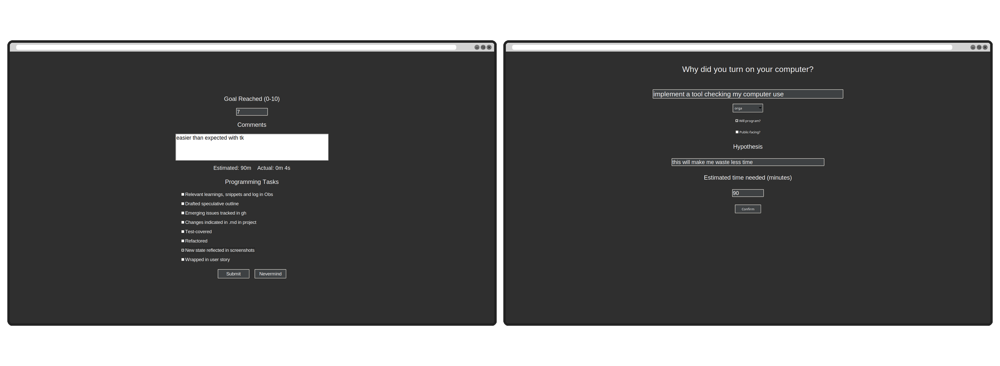

# Why Turn On Computer?

A little tkinter app running on autostart asking me why I turned on my computer, and in the end checks whether I did what I set out to do. In between, lives as a little mini-window on the bottom edge of my screen.

## Running it

- default python app. make a `venv`, install reqs, run `main.py`.
- to be really effective, put the script (e.g. `python3 ~/GITHUB/why-turn-on-computer/main.py`) in OS's autostart
- expects a `goals.txt` file to be present in the folder, where each line represents one high-level goal

## Documentation

- whole thing is mostly controlled by `main.py`
- at heart it's a `pywebview` thing, with one window, being triggered in the `main` function
- the actual UI is determined by `main.html`, an HTML file w/ a little bit of javascript calling back into `main.py` and a shuffle button
- some values are "passed" into the HTML by simply running a replace on the loaded html file before passing it into `create_window`
    - ..like the world's worst templating language
    - ...namely:
        - `$NEXTSTEP`, the current next step that's freely editable in the `<input>` 
            - managed via a getter and setter, `getNextStep()` and `setNextStep()`
            - actual value is saved in a simple config, following best practices with the `appdirs` directory
        - `$GOALS`, which are actually managed in Obs
            - they are recursively parsed out of the Obs dict, half-hard coded, with `find_goals()` and `extract_goals()` and `find_file_in_directory()`, chatGPT functions to start from a goal `.md` file and look for goals in this file recursively, building an array of "leaf" goals with no children
            - `make_goal_select()` takes this array and dynamically builds a `<select>` to be slapped into the HTML string
                - this has surpringly nice affordances, like ability to be shuffled in a line of js in `main.html` w/o callback to python and ofc manual goal selection if one wishes to do so.

### Building

- can be built into an executable, but it's actually more pragmatic to simply run the python script 

- build with `pyinstaller main.py --add-data *html:. --noconfirm` (assumes all relevant assets are html)
- built executable is avaialable at `./GITHUB/goal/dist/main/main`
    - is in the autostart of `Startup Applications`
    - also in the start menu with an Atom copy-pasted desktop shortcut :)
        - this is useful when editing goals in obs, because you have to restart
